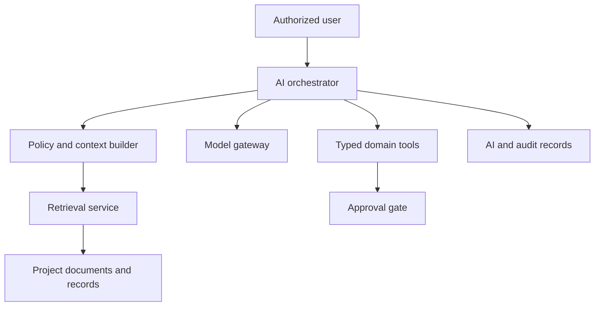

# Construction OS — AI Architecture

**Status:** Proposed for review

## 1. Purpose and boundaries

AI assists with finding, extracting, summarizing, drafting, and proposing. It does not replace deterministic engineering calculations, authorization policies, or accountable human approval.

Permitted initial capabilities:

- answer questions grounded in authorized project documents;
- locate drawings/pages and cite exact sources;
- extract candidate quantities, dimensions, material names, tasks, and progress evidence;
- summarize progress, risks, and outstanding requests;
- draft tasks, calculation inputs, material requirements, and purchase requests;
- explain deterministic calculation results and warnings.

Prohibited without explicit human confirmation:

- approving calculations, progress, or purchase requests;
- committing extracted dimensions as authoritative facts;
- changing permissions or project membership;
- deleting records/files;
- issuing procurement orders or external messages;
- concealing uncertainty, missing context, or conflicting sources.

## 2. Components

- **AI orchestrator:** owns conversation state, plans retrieval/tool use, validates outputs.
- **Policy/context builder:** applies tenant, project, role, and resource authorization before any context is assembled.
- **Ingestion pipeline:** extracts text/layout, chunks it, records coordinates and content hashes, and builds search indexes.
- **Retrieval service:** hybrid lexical/vector retrieval with authorization filtering and reranking.
- **Model gateway:** provider-neutral interface for model selection, retry, timeout, rate limiting, redaction, and cost controls.
- **Typed domain tools:** narrow application commands/queries described by strict schemas.
- **Approval gate:** converts an AI proposal into a user-reviewed command; does not let the model self-approve.
- **Evaluation/observability:** quality, citation, safety, latency, and cost measurements.

## 3. Document ingestion

1. User uploads directly to quarantined object storage.
2. Backend verifies ownership, expected checksum/size/type, and finalizes metadata.
3. Malware scan passes before content processing.
4. Pages, previews, OCR text, layout blocks, tables, and drawing annotations are extracted asynchronously.
5. Every extracted fragment retains company/project/document/file-version/page references, bounding coordinates, extractor version, and confidence.
6. Chunks are produced using document structure and page geometry, not arbitrary token windows alone.
7. Embeddings/search records are upserted by content hash and deleted/restricted when source authorization changes.

Original files remain authoritative. Extracted/OCR text is derived data and can be regenerated.

## 4. Retrieval and grounding

Retrieval is always scoped before ranking:

1. validate conversation and project membership;
2. build an allow-list of source IDs based on policy;
3. run hybrid lexical/vector retrieval inside that scope;
4. rerank for question relevance and source authority;
5. assemble limited context with source metadata;
6. require answer citations to document revision, page, and when available coordinates;
7. return “insufficient evidence” when support is missing or contradictory.

The answer UI must distinguish quoted/extracted evidence, AI interpretation, and deterministic calculated results.

## 5. Tool architecture

Tools call application use cases, never database tables directly. Initial tools can include:

- `search_project_documents`;
- `get_document_page`;
- `get_structure_context`;
- `get_calculation_version`;
- `run_calculation_draft`;
- `get_progress_summary`;
- `draft_task`;
- `draft_material_requirement`;
- `draft_purchase_request`.

Each tool has:

- JSON schema with bounded fields and enums;
- explicit read/write classification;
- required company/project context supplied by the server, not the model;
- permission check at execution time;
- idempotency key for mutations;
- timeout, result-size limit, and safe logging policy;
- human confirmation for consequential writes.

AI-produced mutations first create a proposal/draft with provenance. The user sees the proposed changes, source citations, assumptions, and warnings before confirmation.

## 6. Calculation integration

The model may:

- identify possible dimensions from a drawing;
- map text to an input schema;
- flag missing or inconsistent inputs;
- request clarification;
- explain calculation traces.

The model may not execute hidden arithmetic as the authoritative result. All official results come from the versioned deterministic engine. Candidate values carry source page/coordinates, OCR confidence, unit, and an `ai_proposed` state until confirmed.

## 7. Conversation and message model

`AIConversation` is project-scoped. `AIMessage` is append-only in sequence and records:

- user/assistant/tool role;
- safe content or encrypted/redacted content according to policy;
- model and prompt-template versions;
- cited source IDs and content hashes;
- tool calls and confirmation status;
- token, latency, and cost metadata;
- finish/error status.

Do not place secrets, signed URLs, raw access tokens, or unrestricted sensitive worker data in model context. Conversation export/deletion follows company retention rules while preserving minimum required audit records.

## 8. Security and privacy

- no cross-company retrieval or shared vector namespace without enforced tenant filters;
- providers must not train on customer content unless contractually approved;
- encryption in transit/at rest and regional processing controls;
- prompt injection defense: retrieved documents are untrusted data, never instructions;
- domain tools use server-owned authorization and cannot be redefined by document content;
- sensitive fields are redacted or excluded before model calls;
- model outputs are treated as untrusted and validated before rendering/execution;
- rate, token, file, and spending quotas are enforced per company/project/user.

## 9. Model/provider strategy

The model gateway chooses a profile rather than hard-coding a provider in domain logic. Profiles specify capability, context limit, data residency, cost ceiling, timeout, and fallback eligibility.

Fallback is allowed for summarization/search answers when policy permits. Consequential structured extraction should not silently switch to an unevaluated model; it must fail visibly or use an approved equivalent profile.

## 10. Evaluation and monitoring

Release gates use a versioned evaluation set containing representative construction documents and questions:

- citation precision and citation completeness;
- grounded answer correctness;
- extraction accuracy for quantities, units, dimensions, and document revision;
- abstention on missing/ambiguous evidence;
- tenant-isolation and prompt-injection tests;
- tool argument validity and unauthorized-action refusal;
- latency, token use, and cost per completed task.

Production monitoring records metrics and safe traces, with sampled human review under an approved privacy policy. User corrections feed an evaluation dataset only when permitted; they do not automatically retrain a model.

## 11. Failure behavior

- retrieval unavailable: state that sources could not be checked; do not answer as grounded fact;
- OCR low confidence: show uncertainty and request manual verification;
- conflicting revisions: cite both and require the user to select the authoritative revision;
- model timeout: retry within budget or return a recoverable error;
- tool validation failure: do not partially execute;
- provider outage: use approved fallback or queue the request;
- cost limit reached: stop before the model call and explain the limit.

## 12. Main AI risks

| Risk | Control |
|---|---|
| Hallucinated engineering facts | citations, abstention, deterministic engine, human approval |
| Prompt injection from documents | treat sources as data, typed tools, isolated policies |
| Cross-tenant leakage | pre-retrieval scope filter, tenant tests, separate keys/namespaces as needed |
| Wrong drawing revision | revision-aware retrieval and explicit source display |
| OCR/unit errors | confidence, unit normalization, range checks, manual confirmation |
| Excess cost/latency | budgets, routing profiles, caching of safe derived data, async jobs |
| Provider dependency | gateway abstraction, portable indexes, evaluation before fallback |

## 13. Approval decisions required

Before implementation, approve supported AI use cases, provider/data policy, retention, regions, required human confirmations, citation UX, evaluation thresholds, and per-company cost controls.

