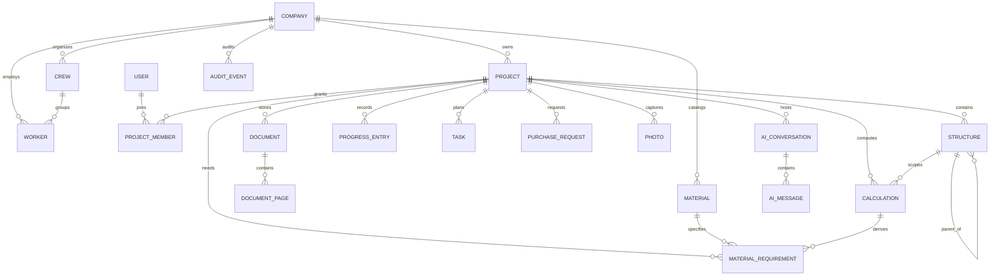

# Construction OS — Database Architecture

**Status:** Proposed for review  
**Database:** PostgreSQL

## 1. Conventions

- Primary keys: UUIDv7 (or equivalent time-sortable UUID), generated by the application/database.
- Tenant key: every tenant-owned table includes `company_id`; project-owned tables also include `project_id`.
- Time: `timestamptz` in UTC; clients localize for display.
- Quantities/money: `numeric`, never floating point; unit and currency are explicit.
- Lifecycle: `created_at`, `updated_at`, optional `archived_at`; hard deletion is exceptional.
- Concurrency: integer `version` incremented on mutation.
- Flexible metadata: JSONB only for bounded, versioned payloads—not core relations.
- Names are snake_case; foreign keys and important business constraints are explicit.

## 2. ER model

Several many-to-many and attachment relationships use join tables described below.

## 3. Core tables

### Company and identity

`companies`

- `id`, `name`, `slug`, `status`, `settings_json`, timestamps, `version`.
- Unique active `slug`.

`users`

- `id`, `email_normalized`, `display_name`, `status`, identity-provider references, timestamps.
- Email is unique when present; authentication secrets are not stored in domain tables.

`company_memberships` (support table)

- `company_id`, `user_id`, `role`, `status`, `invited_by_user_id`, `joined_at`.
- Unique (`company_id`, `user_id`).

### Projects and structures

`projects`

- `id`, `company_id`, `code`, `name`, `description`, `status`, `timezone`, `currency`, planned/actual dates, timestamps, `version`.
- Unique (`company_id`, `code`).

`project_members`

- `id`, `company_id`, `project_id`, `user_id`, `role`, optional permission overrides, `status`, timestamps.
- Unique (`project_id`, `user_id`).

`structures`

- `id`, `company_id`, `project_id`, `parent_id`, `type`, `code`, `name`, `description`, path/order metadata, timestamps, `version`.
- Parent must belong to the same project; prevent cycles.
- Unique (`project_id`, `code`).

### Documents

`documents`

- `id`, `company_id`, `project_id`, optional `structure_id`, `document_type`, `title`, `document_number`, `revision`, `status`, `current_file_version_id`, timestamps, `version`.

`document_file_versions` (support table)

- `id`, `document_id`, `version_number`, object key, original filename, media type, byte size, checksum, scan status, uploaded by, timestamps.
- Unique (`document_id`, `version_number`) and checksum-indexed.

`document_pages`

- `id`, `company_id`, `project_id`, `document_id`, `file_version_id`, `page_number`, dimensions, render object key, OCR status/text/confidence, extraction version, timestamps.
- Unique (`file_version_id`, `page_number`).

### Calculations

`calculations`

- `id`, `company_id`, `project_id`, optional `structure_id`, `type`, `title`, `status`, `current_version_id`, owner/approver IDs, timestamps, `version`.

`calculation_versions` (support table)

- `id`, `calculation_id`, `version_number`, `engine_version`, `input_schema_version`, `input_json`, `result_json`, `trace_json`, `warnings_json`, hashes, executed/approved metadata.
- Immutable after execution; unique (`calculation_id`, `version_number`).

`calculation_sources` (support table)

- `calculation_version_id`, source type/ID, optional page/coordinate reference, purpose.

### Execution and progress

`tasks`

- `id`, `company_id`, `project_id`, optional `structure_id`, parent task ID, title, description, priority, status, dates, progress percent, assignee type/ID, creator, timestamps, `version`.
- Parent belongs to same project; status and percent constraints.

`task_dependencies` (support table)

- `predecessor_task_id`, `successor_task_id`, dependency type, lag duration.
- Unique pair and cycle prevention at application/domain level.

`progress_entries`

- `id`, `company_id`, `project_id`, optional `structure_id`, optional `task_id`, work date/reporting period, quantity, unit, percent, status, notes, author/verifier, timestamps, `version`.
- Quantity non-negative and unit required when quantity exists.

`progress_entry_resources` and `progress_entry_photos` link evidence and labor without polymorphic foreign-key loss.

### Materials and procurement

`materials`

- `id`, `company_id`, `sku`, `name`, `description`, base unit, category, specification JSON, status, timestamps, `version`.
- Unique (`company_id`, `sku`).

`material_requirements`

- `id`, `company_id`, `project_id`, optional `structure_id`, `material_id`, optional `calculation_version_id`, required/ordered/received quantities, unit, need-by date, status, source, timestamps, `version`.
- Unit conversion must be explicit; quantities non-negative.

`purchase_requests`

- `id`, `company_id`, `project_id`, request number, title, status, requester, approver, required date, currency, total estimate, timestamps, `version`.
- Unique (`project_id`, request number).

`purchase_request_items` (support table)

- `id`, `purchase_request_id`, optional `material_requirement_id`, `material_id`, description snapshot, quantity, unit, unit price estimate, currency.
- Snapshot fields preserve the approved request even if catalog data changes.

### Workforce

`workers`

- `id`, `company_id`, optional `user_id`, personnel number, name, trade, qualification, employment status, contact data (encrypted where needed), timestamps, `version`.
- Unique (`company_id`, personnel number); optional User link is unique.

`crews`

- `id`, `company_id`, code, name, foreman worker/user reference, status, timestamps, `version`.

`crew_memberships` (support table)

- `crew_id`, `worker_id`, `valid_from`, `valid_to`, role.
- No overlapping active membership when company policy requires a single crew.

`project_crew_allocations` (support table)

- `project_id`, `crew_id`, allocation dates, capacity percent.

### Photos

`photos`

- `id`, `company_id`, `project_id`, object key, thumbnail keys, checksum, media type, byte size, captured/received timestamps, uploader, EXIF subset, geolocation (restricted), caption, scan status, timestamps.

Typed link tables (`photo_structure_links`, `photo_task_links`, `photo_progress_links`, `photo_document_links`) enforce real foreign keys. A generic attachment table should be avoided unless operational evidence proves it necessary.

### AI

`ai_conversations`

- `id`, `company_id`, `project_id`, creator, title, status, model policy/profile, timestamps, `version`.

`ai_messages`

- `id`, `company_id`, `project_id`, `conversation_id`, sequence number, role, content/redacted content, model/provider metadata, token/cost counters, status, timestamps.
- Unique (`conversation_id`, sequence number).

`ai_message_citations` and `ai_tool_calls` preserve document/page sources, inputs after redaction, results, approvals, and errors.

### Audit

`audit_events`

- `id`, `occurred_at`, `company_id`, optional `project_id`, actor type/ID, action, target type/ID, outcome, request/correlation IDs, IP hash or controlled address, user agent, safe diff JSON, metadata JSON, integrity hash.
- Append-only; partition by month or quarter as volume grows.

## 4. Tenant isolation

Every query is constructed with trusted `company_id` context. Project IDs are never accepted as sufficient authorization. Composite foreign keys are recommended for critical relations, e.g. (`company_id`, `project_id`) referencing a tenant-scoped project key.

PostgreSQL Row Level Security can provide defense in depth:

- transaction sets tenant/user context from verified authentication;
- policies require matching `company_id`;
- worker/service accounts receive only necessary policies;
- migration owner is separate from application role;
- connection-pool reset is tested to prevent context leakage.

Application authorization remains mandatory because RLS alone does not express all project/action policies.

## 5. Indexes and access patterns

Baseline indexes:

- (`company_id`, `status`) on company resources;
- (`project_id`, `updated_at desc`) for project feeds;
- (`project_id`, `structure_id`) for scoped records;
- (`project_id`, work/reporting date) for progress;
- (`conversation_id`, sequence_number`) for AI messages;
- partial indexes for active/pending states;
- GIN indexes only for proven JSONB/full-text access patterns;
- trigram/full-text indexes for user-facing search when required.

Index selection must follow measured queries; tenant key should lead most multi-tenant indexes.

## 6. Transactions and events

Business state and its `outbox_events` record commit together. The outbox contains event ID, aggregate type/ID/version, tenant/project scope, event type/schema version, payload, occurrence time, and dispatch state.

Consumers record processed event IDs or perform naturally idempotent upserts. Ordering is guaranteed only per aggregate through aggregate version checks.

## 7. Migration strategy

- migrations are immutable once deployed;
- use expand -> backfill -> switch -> contract for breaking changes;
- large backfills are resumable background operations;
- new non-null columns are introduced nullable or with safe database defaults;
- application releases remain compatible with both sides of rolling deployment;
- production migration duration and locks are tested on representative data.

## 8. Retention, backup, and recovery

- point-in-time recovery for PostgreSQL;
- encrypted automated backups with cross-region/cross-account copy according to deployment tier;
- object versioning and lifecycle rules;
- regular restore drills, not only backup-success checks;
- audit, financial/procurement, workforce, photos, and AI content have separate retention policies;
- legal/privacy deletion is implemented as an auditable policy workflow, not ad hoc SQL.

Target RPO/RTO values must be approved in `deployment.md` before production.

