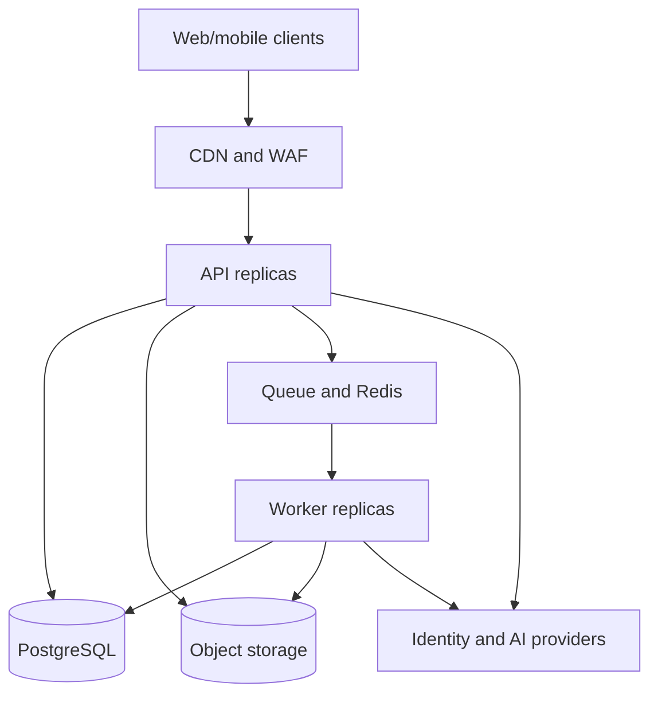

# Construction OS — Deployment Architecture

**Status:** Proposed for review

## 1. Deployment model

The initial system uses independently scalable processes from one modular-monolith codebase:

Deployables:

- `web`: static/server-rendered client behind CDN;
- `api`: stateless HTTP application replicas;
- `worker`: background jobs and outbox consumers;
- optional scheduled-job runner with a single-leader/lease mechanism.

All deployables use the same released application version unless a compatibility-tested rolling window is required.

## 2. Environments

| Environment | Purpose | Data policy |
|---|---|---|
| Local | developer workflow | synthetic fixtures only |
| Test/CI | automated checks | ephemeral synthetic data |
| Staging | production-like validation | synthetic or approved anonymized data |
| Production | customer workloads | controlled access and retention |

Each environment uses separate accounts/projects, databases, buckets, queues, secrets, identity clients, encryption keys, and AI credentials. Production data is never copied to lower environments without an approved anonymization workflow.

## 3. Cloud-neutral component mapping

- managed container platform or Kubernetes for API/worker;
- managed PostgreSQL with multi-zone availability and point-in-time recovery;
- S3-compatible object storage with versioning, lifecycle, and server-side encryption;
- managed Redis and queue where available;
- CDN/WAF and load balancer with TLS termination;
- managed secret store and KMS;
- centralized logs, metrics, traces, and alerting;
- container registry with immutable image digests.

Use managed services for the first stage. Kubernetes should be selected only if existing operations capability or scale justifies it.

## 4. Network and security

- only CDN/WAF/load balancer is public;
- API/worker, database, cache, and queue run in private networks;
- database and cache accept traffic only from required workloads;
- outbound traffic is restricted to approved identity, AI, notification, and storage endpoints;
- workload identity is preferred over static cloud keys;
- TLS is required for external and internal managed-service connections;
- secrets are injected at runtime and never stored in images, source, logs, or job payloads;
- admin access uses SSO, MFA, least privilege, and audited break-glass procedures;
- uploaded files remain quarantined until security checks succeed.

## 5. CI/CD pipeline

Pull request gates:

1. formatting, lint, type checks, and secret scanning;
2. unit and architecture-boundary tests;
3. database migration and integration tests;
4. API contract and authorization/tenant-isolation tests;
5. calculation golden/property tests;
6. dependency, container, and infrastructure scanning;
7. build signed immutable artifacts and generate SBOM;
8. deploy ephemeral/test environment for selected end-to-end tests.

Release flow:

1. merge reviewed change to protected main branch;
2. build once and identify by commit SHA/image digest;
3. deploy the same artifact to staging;
4. run smoke, migration, job, and restore-related checks;
5. require production approval initially;
6. run backward-compatible migrations;
7. roll out API and workers gradually;
8. verify health/SLOs and complete or roll back.

No deployment should rely on mutable `latest` tags.

## 6. Database deployment

Migrations run as a dedicated identity and an explicit deployment step, not automatically from every API replica. They must be backward-compatible with the previous application version.

For breaking changes:

1. expand schema;
2. deploy dual-read/write compatible code if needed;
3. backfill asynchronously with progress/checkpoints;
4. switch reads and verify;
5. remove old schema in a later release.

Blocking operations require reviewed execution plans, lock timeouts, and representative-volume testing.

## 7. Scaling

- API scales horizontally on latency/concurrency/CPU.
- Workers scale independently by queue type and queue age.
- OCR, preview, calculation, AI, notification, and export queues have separate concurrency and quotas.
- Large uploads go directly to object storage using multipart presigned URLs.
- Read replicas may support reporting only when stale-read behavior is explicit.
- Cache is used for reproducible derived/read data, not authorization truth or authoritative business state.

Start with a single primary region. Add multi-region components only after data residency, latency, and recovery requirements justify the operational cost.

## 8. Reliability

Required mechanisms:

- health endpoints distinguish liveness and readiness;
- graceful shutdown stops accepting work and completes/releases jobs;
- API requests have timeouts and bounded retries;
- external calls use circuit breakers, jittered backoff, and idempotency;
- jobs use leases, retry limits, and dead-letter queues;
- transactional outbox prevents lost cross-module events;
- availability-zone redundancy for production database and workloads;
- object storage versioning and database point-in-time recovery.

Proposed starting objectives, subject to business approval:

| Objective | Initial target |
|---|---|
| API availability | 99.9% monthly |
| API latency | p95 under 500 ms for normal non-AI endpoints |
| Critical job start delay | p95 under 60 seconds |
| Database RPO | 15 minutes or better |
| Service RTO | 4 hours or better |

AI/OCR completion has separate asynchronous SLOs and must not degrade core transactional APIs.

## 9. Backup and disaster recovery

- automated database backups plus continuous WAL/PITR;
- encrypted backup copies isolated from the primary administrative boundary;
- object versioning and lifecycle retention;
- infrastructure and configuration reproducible from version control;
- quarterly restore drills initially, with recorded results;
- disaster runbook covering database restore, object reconciliation, queue recovery, key/provider outage, and DNS/certificate recovery;
- restored environment is tested for tenant isolation and application consistency before reopening traffic.

RPO/RTO targets must be validated through drills.

## 10. Observability and alerting

Dashboards cover:

- request rate, latency, errors, saturation, and authorization denials;
- database connections, locks, query latency, replication, and storage;
- queue depth/age, retries, dead letters, and worker throughput;
- upload/scan/OCR/indexing success and duration;
- calculation failures and engine-version distribution;
- AI latency, provider errors, token/cost budgets, and citation-quality signals;
- tenant-level usage with privacy-safe labels and cardinality controls.

Alerts are actionable and linked to runbooks. Logs are structured, correlated, access-controlled, redacted, and retained by policy.

## 11. Configuration and secrets

Configuration is validated at startup. Non-secret configuration is environment-specific and versioned. Secrets are stored in a managed vault, rotated, and referenced by workload identity.

Feature flags support safe rollout but must not bypass authorization or leave permanent dual behavior. Kill switches are required for AI providers, uploads, expensive jobs, and outbound notifications.

## 12. Cost controls

- per-company upload/storage and AI budgets;
- lifecycle older derived previews/exports when reproducible;
- worker concurrency limits and scale-to-demand;
- database/storage/egress cost dashboards;
- model routing by approved capability profile;
- alerts before quotas are exhausted;
- prohibit unbounded high-cardinality telemetry.

## 13. Rollback strategy

Application rollback uses the previous signed artifact. Schema changes remain backward-compatible; destructive contraction happens only after the rollback window. Failed jobs stay replayable. External side effects require idempotency and compensating workflows rather than pretending the transaction can be rolled back.

## 14. Deployment risks

| Risk | Mitigation |
|---|---|
| Migration locks/outage | expand-contract, timeouts, volume rehearsal |
| Worker version mismatch | versioned job/event schemas, controlled rollout |
| Queue storm after outage | bounded retries, jitter, rate limits, priority queues |
| Secret leakage | vault, workload identity, redaction, scanning, rotation |
| Data loss/ransomware | isolated backups, object versioning, restore drills |
| AI/provider outage | circuit breakers, approved fallbacks, async degradation |
| Cost spike | quotas, budgets, concurrency limits, usage alerts |
| Regional outage | tested restore plan; multi-region only when justified |

## 15. Decisions required before implementation

Approve cloud/region, expected user/file volume, data residency, identity provider, RPO/RTO/SLOs, retention periods, AI providers, operating budget, and on-call ownership. Until these decisions and the architecture documents are reviewed, business implementation remains out of scope.

